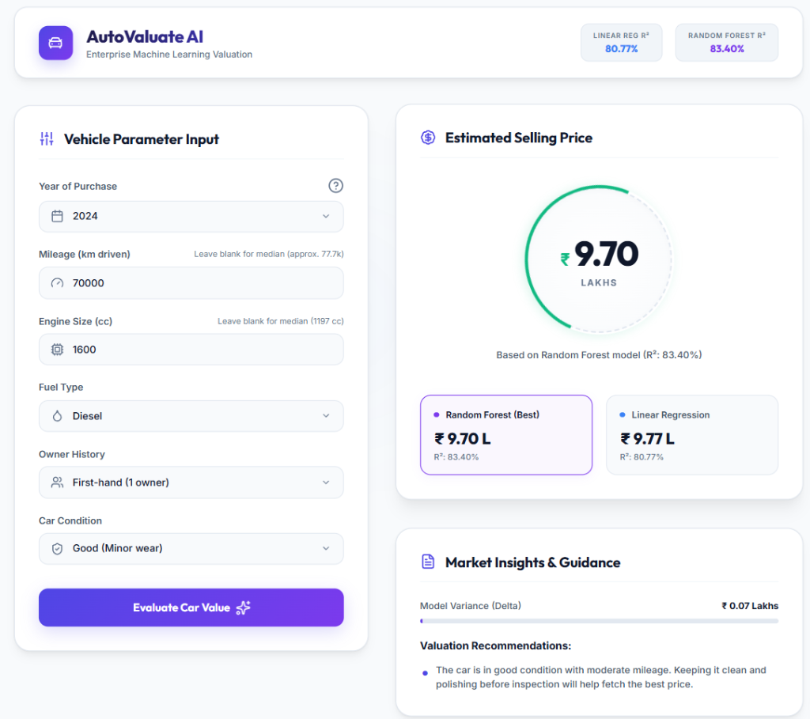

# Car Price Prediction Model

An interactive, end-to-end Machine Learning web application that estimates the resale value of a car based on various features using both **Linear Regression** and **Random Forest Regressor** models.



---

## 📊 Dataset Description
The model is trained on a simulated dataset (`car_details.csv`) which replicates typical used car market dynamics:
- **Year**: The year of purchase (from 2012 to 2024).
- **Mileage**: Total kilometers driven (with simulated missing entries).
- **Fuel_Type**: Engine fuel type (`Petrol`, `Diesel`, or `CNG`).
- **Engine_Size**: Engine size in cubic centimeters (cc, e.g., 998cc, 1197cc, etc.).
- **Owner_Type**: Number of previous owners (`First-hand`, `Second-hand`, `Third-hand`).
- **Car_Condition**: General wear-and-tear condition (`Excellent`, `Good`, `Fair`, `Poor`).
- **Selling_Price**: Target variable representing the valuation price of the car (in Lakhs).

---

## 🔧 Steps Implemented

### 1. Import Dataset
- Generates or imports the dataset (`car_details.csv`) representing vehicle records.

### 2. Data Cleaning & Preprocessing
- **Handling Missing Data**: Identifies and fills missing entries in `Mileage` and `Engine_Size` using the robust **median** value of each feature.
- **Categorical Conversion**: Encodes string labels (`Fuel_Type`, `Owner_Type`, `Car_Condition`) to order-sensitive and category-appropriate integers.
- **Feature Scaling**: Applies a `StandardScaler` to normalize numerical parameters before model fitting.

### 3. Train/Test Split
- Splits data into a **Training set (80%)** and a **Test set (20%)**.

### 4. Choose Model
- Initializes and fits two regression pipelines:
  - **Linear Regression**: A baseline model mapping linear relationships.
  - **Random Forest Regressor**: A robust ensemble decision-tree model capturing non-linear relationships.

### 5. Train the Model
- Fits both models onto the training set.

### 6. Test the Model
- Evaluates R² accuracy and error metrics on the test set:
  - **Linear Regression Accuracy**: ~80.77%
  - **Random Forest Accuracy**: ~83.40%

### 7. Make Predictions
- Takes input parameters, cleans/imputes any empty parameters, applies normalization, predicts the price using both estimators, and showcases predictions side-by-side.

---

## 🖥️ Localhost Web Application
To demonstrate the model's capabilities in a real-world scenario, a premium web application dashboard is built on top of the model.

### Features:
- **Premium Light Theme UI**: Implements a clean, high-contrast dashboard with a refined off-white background, deep slate typography, soft card borders, and beautiful layered shadows.
- **Interactive Price Showcase**: Displays the final valuation dynamically with counting numbers and model details.
- **Side-by-Side Model Comparison**: Toggles between predictions from **Random Forest** and **Linear Regression** on demand.
- **Data Imputation Feedback**: Highlights if missing parameters (e.g. blank mileage or engine size) were filled automatically by the server.
- **Market Recommendations**: Displays helpful tips to increase resale value or prepare for transaction negotiations based on the input details.


---

## 📁 Repository Folder Structure
```
├── templates/
│   └── index.html               # Frontend HTML structure for the web dashboard
├── static/
│   ├── style.css                # Premium light theme styling sheet
│   └── app.js                   # Javascript handler for async predictions & animations
├── car_details.csv              # Generated car dataset file
├── car_details_generator.py     # Python script to generate the synthetic dataset
├── car_model.py                 # Standalone CLI python script (Imports, cleans, trains & tests)
├── train.py                     # Python training pipeline that outputs serialization files
├── app.py                       # Flask server running on http://localhost:5000
├── linear_reg_model.pkl         # Serialized Linear Regression model file
├── random_forest_model.pkl      # Serialized Random Forest model file
├── scaler.pkl                   # Serialized StandardScaler object file
├── imputer.pkl                  # Serialized median imputer values
├── mappings.pkl                 # Serialized categorical mappings
├── requirements.txt             # Required python packages for installation
└── .gitignore                   # Files to exclude from repository tracking
```

---

## 🚀 How to Run Locally

### 1. Install Dependencies
Make sure you have Python 3 installed, then run:
```bash
pip install -r requirements.txt
```

### 2. Run the Standalone Script (CLI)
To run the standard evaluation pipeline and output metrics:
```bash
python car_model.py
```

### 3. Run the Training Pipeline (Optional)
To retrain and regenerate model files:
```bash
python train.py
```

### 4. Start the Web Dashboard
Start the Flask development server:
```bash
python app.py
```
Open your web browser and go to:
👉 **[http://127.0.0.1:5000](http://127.0.0.1:5000)**
